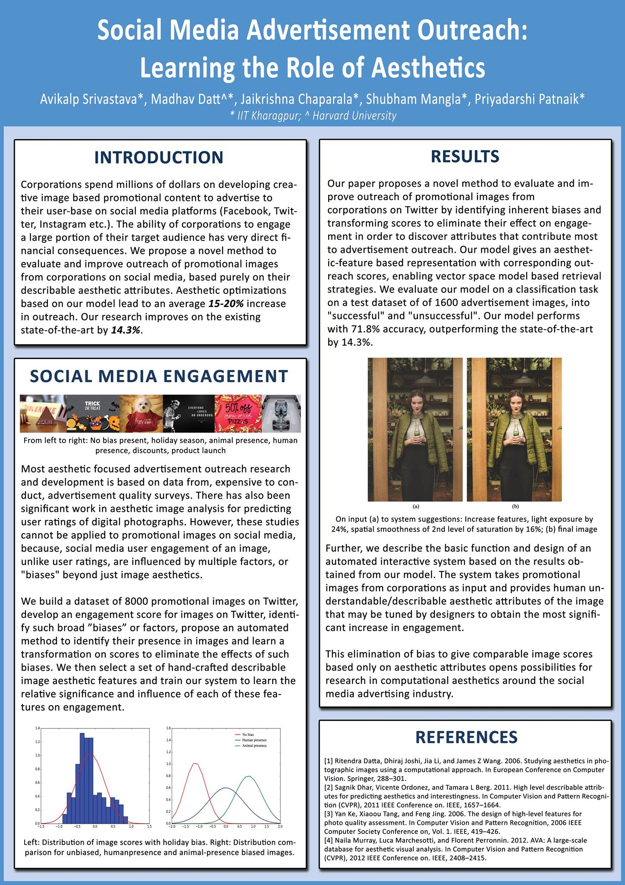
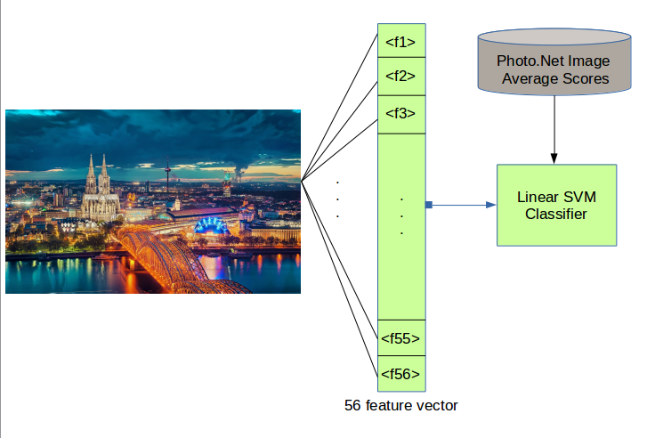

# Image.Aesthetics.Learning
Code and data for my paper at ACM SIGIR 2017 - **Social Media Advertisement Outreach: Learning the Role of Aesthetics** [[pdf]](https://arxiv.org/abs/1705.02146)

## Aesthetic Feature to Engagement Learning on Photnet Data

### Photo.Net Dataset

This dataset contains 20,278 images, which have each received at least 10 ratings, along with their average score ratings. 
The links for the datsets can be found [here](http://ritendra.weebly.com/aesthetics-datasets.html)

Due to copyright issues, the image data cannot be re-distributed and is the same reason we do not distribute the original images.

To scrape these images, use the script "*PhotonetImageScraping.py*" in the directory "ScraperScripts"

### Feature Extraction and Learning

Since our final aim is learning on interpretable image features that easily translate to modern editing tools, we utilize the 56 hand-crafted features designed and explained in [this](http://infolab.stanford.edu/~wangz/project/imsearch/Aesthetics/ECCV06/datta.pdf) paper for learning the role in user engagement.

The script for features - "*selected_features.py*" resides in the "FeatureExtraction" directory, where given the folder containing your images of interest, the feature vector for each is computed and the feature matrix is saved as a *.npy* file.

